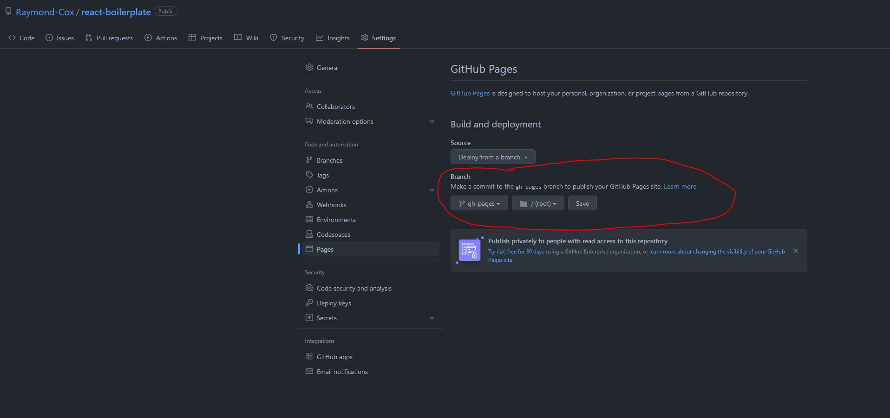

# react-boilerplate

A template to start React projects using Parcel as the bundler.

## Getting Started

Click the green "Use this template" button in the top of this repo. Create a new repository.

Afterwards clone the repo to your local machine. Then run `npm install`, followed by `npm run start`.

Check the scripts in `package.json` for further options.

## Toolchains

includes the following toolchains setup and configured:

- [parcel](https://parceljs.org/) - Build tool
- [prettier](https://prettier.io/) - Formatter
- [eslint](https://eslint.org/) - Linter
- [jest](https://jestjs.io/) - Unit Testing
- [babel](https://babeljs.io/) - Compiler
- [husky](https://github.com/typicode/husky) - Pre-commit Hook

Note: Babel was included primarily for Jest testing React components. Parcel handles the rest of the project under the hood (with their own Babel configuration). Parcel is setup within this project to stay out of the way when necessary for our configuration.

## Libraries

Aside from the React libraries, this project includes:

- [Axios](https://axios-http.com/)

## Pre-Commit Hook (Husky)

Husky runs before each git commit, ensuring lint/formatting stays intact. It is configured to format the entire project with prettier, and check for any outstanding eslint errors.

## Github Actions

2 actions are configured in this project:

1.  PR-Checks (audit, format, lint, test, build)
2.  Merge-to-Main (audit, test, build, deploy)

## Deployment

This is setup to deploy for Github Pages. The `Merge-to-main` Github action updates the `gh-pages` branch in the repo with the bundled production dist folder.

To manage GitHub pages:

1.  Inside the repo click `Settings`
2.  Under code and automation section click `Pages`.

It's important to NOT change the branch dropdown from `gh-pages`. Reference image below.

## Extras

- Eslint configuration extends the [js-standard](https://standardjs.com/).
- CSS choice is up to you. Parcel is pre-configured to handle nearly anything except CSS-in-JS. I do recommend using css modules over plain css, because plain css changes do not trigger hot reloads for some reason.
